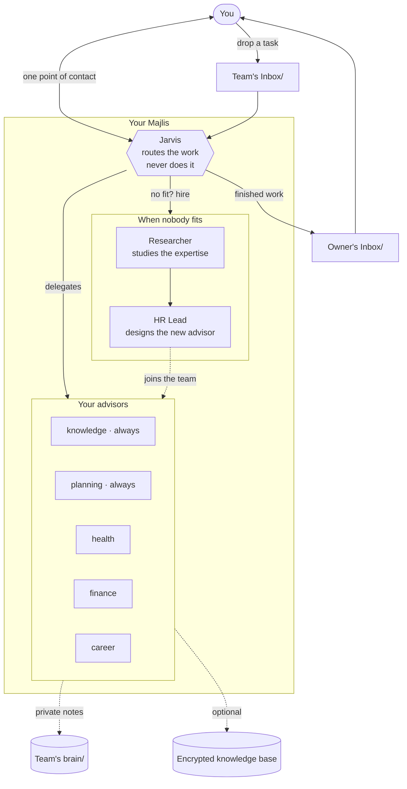

# Majlis

**Your own small team of AI advisors — for your life, not your code.**

You talk to one of them. They handle the rest.

---

Imagine having a chief of staff who keeps your goals on track, a health coach who remembers your
last blood test, and a finance advisor who knows your accounts — plus one person you talk to who
passes your questions along to whichever of them should answer.

That's Majlis. It runs inside [Claude Code](https://claude.com/claude-code), and you set it up in
about two minutes.

> *Majlis* (مجلس) is Arabic for "a place of sitting" — the room where advisors gather.

**You don't need to know anything about AI agents to use this.** If you can type a sentence into a
terminal, you can run it. The technical details all live near the bottom of this page, and you can
happily ignore them.

---

## What you can ask it

Real things people use it for:

> *"I have a performance review in three weeks. Help me prepare."*

> *"Here are my blood test results. What should I be paying attention to?"*

> *"I want to save for a house in four years. Is that realistic on my income?"*

> *"What did I say I'd do this month, and how far behind am I?"*

> *"Remember that my sister's birthday is in March and she likes pottery."*

You write it in plain language. Behind the scenes it goes to whichever advisor is right for it, and
the answer comes back to you.

---

## Get started

### You'll need two things first

| | |
|---|---|
| **Claude Code** | The app this runs inside. [Install it here](https://claude.com/claude-code) — takes a minute. |
| **Python 3** | Already on every Mac and Linux machine. On Windows, [get it here](https://www.python.org/downloads/). Check yours with `python3 --version`. |

That's it. Nothing else to install, no accounts to create, no servers to run.

### Step 1 — Download it

```bash
git clone https://github.com/shenril/majlis.git majlis
cd majlis
```

### Step 2 — Build your council

```bash
python3 install.py
```

This asks a few friendly questions — **which parts of your life you want help with**, and **what
you'd like to call each advisor**. It looks like this:

```
Your council always includes Jarvis (orchestrator), HR Lead and Researcher.
These two run the machinery every other advisor depends on:

  · Knowledge Engineer — Owns the knowledge base: schema, ingestion, search, migrations.
  name for the knowledge advisor [Knowledge Engineer]: Alfred

  · Chief of Staff — Owns the goal cascade, habits, and the review rhythm.
  name for the planning advisor [Chief of Staff]:

Now the elective themes — pick the parts of your life to delegate:

  · health — Nutrition, biomarkers, and training programs.
  delegate health? [Y/n]: y
  name for the health advisor [Health Coach]: Coach

  · finance — Net worth, cash flow, and multi-year investment planning.
  delegate finance? [Y/n]: n

  · career — Levelling, promotion evidence, sponsorship, and personal brand.
  delegate career? [Y/n]: y
  name for the career advisor [Career Coach]:
```

Press Enter to accept a suggested name, or type your own. **Only pick the areas you actually
want** — you can add more whenever you like.

In a hurry? `python3 install.py --defaults` accepts everything and asks nothing.

### Step 3 — Say hello

Open the folder in Claude Code:

```bash
claude
```

Then just start talking:

> **You:** Jarvis, introduce me to my council.

**Jarvis** is your single point of contact. You never have to remember who does what — tell Jarvis
what you need, and it finds the right advisor.

---

## Your first conversation

The best first move is letting your advisors get to know you:

> **You:** Jarvis, I'd like to start my intake.

Each advisor interviews you about their area — your goals, your constraints, what you've already
tried. They ask one question at a time and follow up when an answer is vague, because a plan built
on guesses isn't much of a plan.

Stop whenever you like and pick it up later. Nothing gets lost.

**Other good openers:**

- *"Jarvis, what's on my plate this week?"*
- *"Jarvis, ask my health advisor to build me a training plan."* — you can name an advisor directly
- *"Jarvis, I need help with something nobody on the team covers."* — see [growing your team](#growing-your-team)

---

## Who's on your team

Three members always come along. They run the machinery:

| | Role |
|---|---|
| **Jarvis** | Your single point of contact. Listens, decides who should handle it, reports back. |
| **HR Lead** | Hires new advisors when you need one that doesn't exist yet. |
| **Researcher** | Digs into any topic properly, and researches what a new advisor should know. |

Then the advisors themselves. **You choose which ones you want and what to call them** — the names
below are only suggestions:

| | Covers | Always included? |
|---|---|---|
| **Knowledge Engineer** | Your notes, contacts, files — everything the team remembers | Yes |
| **Chief of Staff** | Goals, habits, planning, and keeping you honest about progress | Yes |
| **Health Coach** | Nutrition, training, lab results, body metrics | Your choice |
| **Finance Advisor** | Net worth, cash flow, long-term money planning | Your choice |
| **Career Coach** | Promotions, evidence of impact, sponsorship, personal brand | Your choice |

The first two come along no matter what, because every other advisor leans on them — one keeps the
memory, the other keeps the plan.

> **These are examples, not prescriptions.** Rename them, replace them, drop the ones you don't want.

---

## Growing your team

Here's the part people tend to like most: **ask for something nobody covers, and the team hires
someone.**

> **You:** Jarvis, I'm planning six months in Japan and I need help.

Jarvis sends **Researcher** to study what a great relocation advisor actually knows — visas,
logistics, the questions people forget to ask. **HR Lead** turns that research into a new advisor
with a name and a clear remit. Then your new advisor gets to work.

Your council grows to fit your life, instead of you fitting your life to it.

---

## Two folders you'll actually use

```
Team's Inbox/    →   you drop things here for the team
Owner's Inbox/   →   finished work appears here for you
```

Drop a PDF, a screenshot, a messy note — anything — into `Team's Inbox/`, then say *"Jarvis, check
the inbox."* When the work is done you'll find it written up in `Owner's Inbox/`.

That's the whole workflow. No app, no dashboard, just files you can read.

---

<br>

# Under the hood

Everything below is optional reading. Your council works without you knowing any of it.

---

## How it fits together



**The one rule that makes it work:** Jarvis routes and summarises but never does the work itself.
That keeps each advisor sharp in their own lane, and keeps the whole thing predictable.

## Why there's a setup step

Majlis ships **blank templates, not finished advisors.** `install.py` fills them in with the names
you chose and the areas you picked, and writes out:

| What | Where |
|---|---|
| Your advisors | `.claude/agents/` |
| Their interview questions | `.claude/skills/<name>-intake/` |
| Your team list | `team/roster.md` |
| Your profile | `team/owner-profile.md` |
| Their private notebooks | `Team's brain/` |

All of that is **generated**, and none of it is committed to git. The tracked source lives in
`templates/`.

**Changed your mind?** Run `python3 install.py` again. It rewrites everything, and if you renamed or
removed an advisor it clears the old one away. Two things it will never touch: advisors the team
*hired* (it didn't create those), and anything in `Team's brain/` — that's their working memory, and
losing it to a rename would be rude.

Because generated files get overwritten, **edit `templates/` if you want a change to stick.**

## Where everything lives

```
majlis/
├── install.py            ← run this first
├── CLAUDE.md             ← the house rules every advisor reads
├── templates/            ← the blanks install.py fills in
├── team/roster.md        ← who's on your team (generated)
├── Team's Inbox/         ← you drop things here
├── Owner's Inbox/        ← finished work lands here
├── Team's brain/         ← each advisor's private notes
├── database/             ← optional encrypted memory
├── integrations/         ← optional, see below
└── tests/
```

## Optional: give your council a real memory

Out of the box your advisors remember things in plain Markdown files. If you'd like something
sturdier — searchable, structured, encrypted — there's a SQLite knowledge base in `database/`.

- **`schema.sql`** — the structure: 63 tables covering notes, contacts, goals, habits, health
  metrics, accounts and more. [`THEMES.md`](database/THEMES.md) explains what belongs to what.
- **`validate_staged.sh`** — a safety gate. Every change is dry-run against a throwaway copy first
  and rejected unless it's safely repeatable.
- **SQLCipher encryption** — the real database is encrypted on disk, and no advisor ever holds your
  passphrase. You apply changes yourself.

Entirely optional. Delete `database/` and everything else still works.

## Optional: watch your advisors work

By default a terminal multiplexer just sees "Claude Code running", not which advisor is busy. Set
one environment variable and Majlis reports **who currently has the floor, and whether they're
waiting on you**:

```bash
export MAJLIS_BACKEND=herdr    # or: log
```

| Backend | What it does |
|---|---|
| `noop` *(default)* | Nothing at all. |
| `herdr` | Labels your [Herdr](https://herdr.dev) pane with the active advisor. |
| `log` | Writes a JSONL activity log — works with no extra tools. |

Off unless you turn it on. Details in [`integrations/README.md`](integrations/README.md).

## Keeping your data private

**This is your personal life. Treat the folder accordingly.**

- Everything in `Owner's Inbox/`, `Team's Inbox/`, `Team's brain/` and your profile is **private and
  git-ignored** — but if you fork this publicly, check before you push.
- If you use the encrypted database, your **passphrase belongs in a password manager** — never in a
  file, never in the repo, never in an environment variable you commit.
- The shipped templates contain no personal data. Keep it that way.

## Make it yours

- **Rename your advisors** any time — re-run `install.py` with different names.
- **Change how one behaves** by editing its template in `templates/advisors/`.
- **Change the house rules** in `CLAUDE.md` — the charter every advisor reads.
- **Just ask for what you need.** The fastest way to grow your council is to ask for something it
  can't do yet and let it hire.

One thing is fixed: **the orchestrator is always called Jarvis.** The charter names it throughout,
which is what lets a fresh copy work before you've run anything.

## Common questions

**Do I need to know how to code?**
No. Two commands to set up, and after that it's a conversation.

**Does this send my data anywhere?**
Only to Claude, the same as any Claude Code session. Nothing else phones home — no servers, no
accounts, no telemetry.

**Can I add advisors later?**
Two ways: re-run `install.py` to switch on an area you skipped, or ask Jarvis for something new and
let the team hire someone.

**What if I mess it up?**
Run `python3 install.py` again. It rebuilds everything from the templates.

**Is this medical or financial advice?**
No — and the health and finance advisors say so themselves, repeatedly. They exist to help you
prepare for conversations with real professionals, not to replace them.

---

Contributions welcome — see [CONTRIBUTING.md](CONTRIBUTING.md).
Licensed under [MIT](LICENSE).
