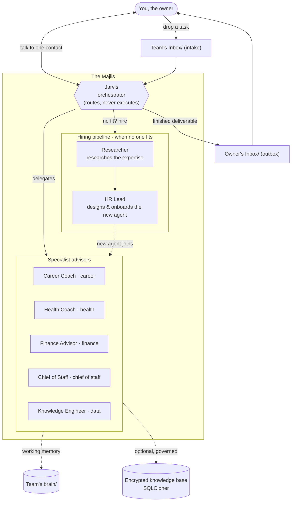

# Majlis

**Your personal council of AI advisors — an orchestrator plus a roster of named specialist
subagents you run inside [Claude Code](https://claude.com/claude-code).**

*Majlis* (مجلس) means "a place of sitting" — a council chamber where advisors gather. This
template gives you exactly that: a single orchestrator you talk to, a team of specialist
personas it dispatches on your behalf, and a pipeline that lets the team **hire new members**
when a request needs expertise nobody has yet.

Most Claude Code subagent kits are built for shipping software — coding agents, git
worktrees, PR review. Majlis is different: it's a council for **your life and work** — career,
health, finances, routines, and whatever else you add — that grows itself over time.

---

## How it works

You speak to **one** point of contact: the orchestrator (shipped as *Jarvis*). It never does
the work itself — it understands your request, picks the right specialist, and delegates.
When no specialist fits, it runs a **hiring pipeline** to create one, then delegates.



### Core concepts

- **Orchestrator-only contact.** You address one member (*Jarvis*). It routes, synthesizes,
  and reports back — but never writes the code, the plan, or the research itself. That
  separation keeps the system predictable and keeps each specialist sharp in its lane.
- **Named personas.** Every member has a human name, a persona, and a defined scope, so you
  can address them directly: *"Jarvis, ask Finance Advisor to review my portfolio."*
- **A self-growing team (the hiring pipeline).** When a request needs expertise no member
  has, the orchestrator dispatches **Researcher** to research what a real expert in that domain
  actually does, then **HR Lead** to design and onboard a new agent from that research. The
  team literally grows to fit your life.
- **File-based inbox workflow.** `Team's Inbox/` is where **you drop tasks**; `Owner's Inbox/`
  is where **finished deliverables land** for you. Simple, auditable, and nothing gets lost.
- **`Team's brain/` working memory.** Each member owns a private scratch folder for notes and
  in-progress state, so a long task survives interruptions and session limits.
- **Optional DB governance layer.** An encrypted SQLCipher knowledge base, governed by a
  canonical `database/schema.sql` and a pre-apply `validate_staged.sh` gate that dry-runs
  every migration before it touches your real data. Entirely optional — skip it if you don't
  want a database.

---

## Quickstart

1. **Clone the repo.**
   ```bash
   git clone <your-fork-url> majlis && cd majlis
   ```
2. **Run the installer — this is a prerequisite, not an optional step.**
   ```bash
   python3 install.py
   ```
   It asks which parts of your life you want to delegate (health, finance, career — plus the two
   advisors everything depends on) and **what to call each advisor**, then renders your agent
   files, your roster, your brain folders, and your owner dossier. Python 3 standard library
   only — nothing to install.

   The repo ships **boilerplate in `templates/`, not finished agents**, so until you run this
   there are no advisors to talk to. A re-run overwrites the generated files.
3. **Open the folder in Claude Code.** The charter in `CLAUDE.md` loads automatically and
   defines how the orchestrator behaves.
4. **Talk to Jarvis.** Just describe what you need in plain language:
   > "Jarvis, help me prep for a performance review next month."
5. **Let it route or hire.** If a specialist fits, Jarvis delegates to them. If not, Jarvis
   runs the hiring pipeline (Researcher → HR Lead) to create the right specialist, then
   delegates.
6. **Or work through the inbox.** Drop a task file into `Team's Inbox/` and say *"Jarvis,
   check the inbox."* Finished deliverables appear in `Owner's Inbox/`.

One install step, no services to run — it's Markdown, a few scripts, and Claude Code.

---

## The shipped roster

These members ship as **working examples** — adapt, rename, or delete them to fit your life.

**Founding team (the machinery):**

| Member | Role | One-liner |
|---|---|---|
| **Jarvis** | Orchestrator | The single point of contact. Routes all work; never executes it. |
| **HR Lead** | Head of People (HR) | Designs and onboards new AI team members from research. |
| **Researcher** | Senior Researcher | Researches the expertise needed to hire well, and anything else. |

**Example specialists (adapt to you):**

| Member | Domain | One-liner |
|---|---|---|
| **Career Coach** | Career | Career strategy, reviews, narratives, and growth planning. |
| **Health Coach** | Health | Habits, fitness, and wellbeing planning (with safety disclaimers). |
| **Finance Advisor** | Finance | Personal finance, budgeting, and portfolio thinking (not licensed advice). |
| **Chief of Staff** | Chief of Staff | Routines, scheduling, follow-ups, and keeping things moving. |
| **Knowledge Engineer** | Data Management | Owns the knowledge base: schema, migrations, and the validator gate. |

Each specialist file starts with `# Example team member — adapt to your life.` They're
scaffolding, not prescriptions.

---

## Optional: the encrypted knowledge base

If you want your council to remember structured facts about your life, Majlis ships an
optional DB governance layer under `database/`:

- **`schema.sql`** — the canonical structure (DDL only, no data). Any member writing SQL
  checks this first, so nobody invents a phantom column.
- **`validate_staged.sh`** — a pre-apply gate that dry-runs every staged `.sql` file against a
  throwaway rebuild from `schema.sql` before anything reaches your real database.
- **SQLCipher encryption** — the live database is encrypted at rest; helper scripts
  (`db_connect.py`, `encrypt_db.sh`) show the pattern.

You never have to use it. Delete `database/` and the council still works fine as a
pure-orchestration template.

---

## Optional: see your council in an agent runtime

Majlis members are dispatched as in-process subagents, so by default a terminal multiplexer sees
one Claude Code process rather than seven advisors. Set `MAJLIS_BACKEND` and Majlis will report
**which advisor currently holds the floor, and whether it's blocked on you**, to an external
runtime:

```bash
export MAJLIS_BACKEND=herdr    # or: log
```

| Backend | What it does |
|---|---|
| `noop` *(default)* | Nothing at all. |
| `herdr` | Labels your [Herdr](https://herdr.dev) pane with the live advisor and its state. |
| `log` | Appends JSONL to `Team's brain/jarvis/agent-events.jsonl` — works with no runtime. |

Adding another runtime means writing one small adapter against a four-verb contract. Details and
the known trade-offs are in [`integrations/README.md`](integrations/README.md).

**This is entirely optional and off unless you opt in.** Leave `MAJLIS_BACKEND` unset and the
hooks exit immediately.

---

## Security note

**Never commit your knowledge base or your passphrase.**

- The included `.gitignore` already excludes `*.db`, `*.bak`, and personal SQL/data files —
  but treat that as defense-in-depth, not your only guard.
- Your SQLCipher **passphrase lives only in your password manager** — never in the repo,
  never in a file, never in an environment file you commit.
- Anything you put in `Owner's Inbox/`, `Team's Inbox/`, or `Team's brain/` is **your private
  content** — keep it out of any public fork.

Before you push anything public, scan for personal data. This template ships clean; keep it
that way.

---

## Adapt it to you

- **Rename the orchestrator** if *Jarvis* isn't your style — it's just a name in `CLAUDE.md`
  and the agent files.
- **Swap the specialists.** Keep the founding trio (they run the machinery); replace the five
  example advisors with the roles *you* need — a writer, a legal researcher, a travel planner,
  a startup co-founder.
- **Let the team hire.** The fastest way to build your council is to just ask: *"Jarvis, I
  need help with X."* If no one fits, the hiring pipeline builds the specialist for you.
- **Keep the charter as your contract.** `CLAUDE.md` is the operating charter every member
  reads. Edit it to change how your council behaves.

---

## License

MIT — see [LICENSE](LICENSE). Contributions welcome; see [CONTRIBUTING.md](CONTRIBUTING.md).
