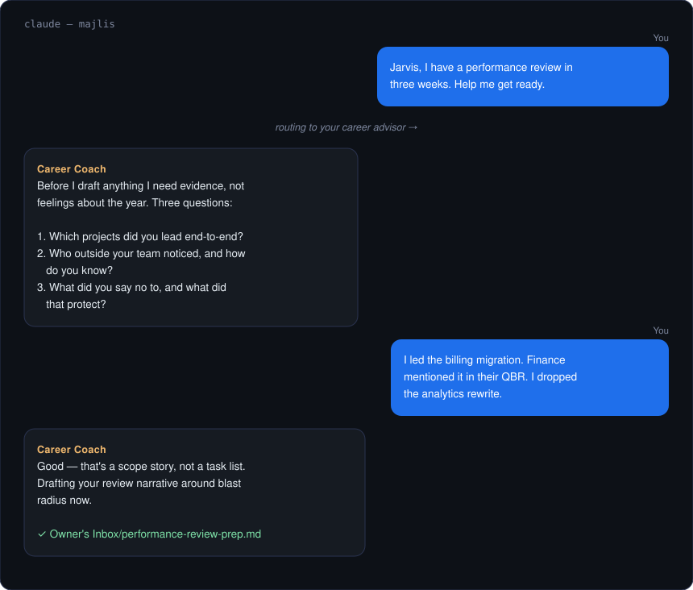
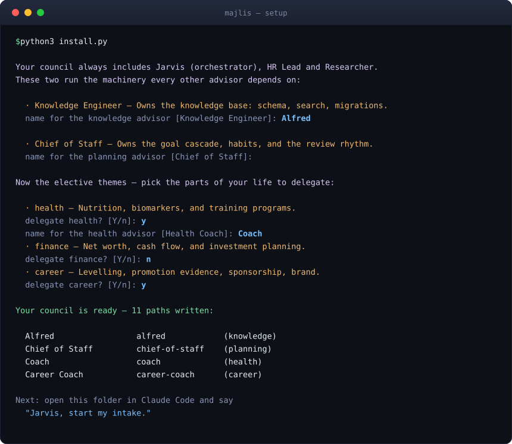

<div align="center">


<br>

**A chief of staff who keeps your goals on track. A health coach who remembers your last blood
test. A finance advisor who knows your accounts.**
<br>
**One person you talk to — who passes your question to whichever of them should answer.**

<br>

[](https://claude.com/claude-code)
[](#)
[](https://www.python.org/downloads/)
[](LICENSE)
[](CONTRIBUTING.md)

<br>

[**Get started**](#-get-started) · [**What you can ask**](#-what-you-can-ask-it) ·
[**Your team**](#-whos-on-your-team) · [**How it works**](#-under-the-hood)

</div>

---

Most Claude Code setups are built for shipping software — coding agents, worktrees, PR review.

**Majlis is for your life instead.** Career, health, money, habits, everything you keep meaning to
get to. It sets up in about two minutes, and you don't need to know the first thing about AI agents
to use it.

> *Majlis* (مجلس) is Arabic for "a place of sitting" — the room where advisors gather.

<br>

## 💬 What you can ask it



Real things people use it for:

|  |  |
|---|---|
| 🎯 | *"I have a performance review in three weeks. Help me prepare."* |
| 🩺 | *"Here are my blood test results. What should I be paying attention to?"* |
| 💰 | *"I want to save for a house in four years. Is that realistic on my income?"* |
| 📋 | *"What did I say I'd do this month, and how far behind am I?"* |
| 🧠 | *"Remember that my sister's birthday is in March and she likes pottery."* |

You write it in plain language. It goes to whichever advisor is right for it. The answer comes back
to you.

<br>

## 🚀 Get started

### You'll need two things

|  |  |  |
|---|---|---|
| **Claude Code** | The app this runs inside | [Install it](https://claude.com/claude-code) — takes a minute |
| **Python 3** | Already on every Mac and Linux machine | On Windows, [get it here](https://www.python.org/downloads/) |

Nothing else. No accounts, no servers, no packages to install.

### 1 · Download it

```bash
git clone https://github.com/shenril/majlis.git majlis
cd majlis
```

### 2 · Build your council

```bash
python3 install.py
```

It asks which parts of your life you want help with, and what you'd like to call each advisor:



Press **Enter** to accept a suggested name, or type your own. **Only pick the areas you actually
want** — you can add more any time.

> In a hurry? `python3 install.py --defaults` accepts everything and asks nothing.

### 3 · Say hello

```bash
claude
```

> **You:** Jarvis, introduce me to my council.

**Jarvis** is your single point of contact. You never have to remember who does what — just say what
you need.

<br>

## ✨ Your first conversation

The best first move is letting your advisors get to know you:

> **You:** Jarvis, I'd like to start my intake.

Each advisor interviews you about their area — your goals, your constraints, what you've already
tried. They ask **one question at a time** and follow up when an answer is vague, because a plan
built on guesses isn't much of a plan.

Stop whenever you like and pick it up later. Nothing gets lost.

**Other good openers:**

- *"Jarvis, what's on my plate this week?"*
- *"Jarvis, ask my health advisor to build me a training plan."* — you can name an advisor directly
- *"Jarvis, I need help with something nobody on the team covers."* — see [below](#-your-team-grows-itself)

<br>

## 👥 Who's on your team

Three members always come along. They run the machinery:

| | | |
|---|---|---|
| 🎩 | **Jarvis** | Your single point of contact. Listens, decides who handles it, reports back. |
| 🤝 | **HR Lead** | Hires new advisors when you need one that doesn't exist yet. |
| 🔍 | **Researcher** | Digs into any topic properly — and researches what a new advisor should know. |

Then the advisors. **You choose which ones you want and what to call them** — these names are only
suggestions:

| | | Covers | Always? |
|---|---|---|---|
| 🧠 | **Knowledge Engineer** | Your notes, contacts, files — everything the team remembers | ✅ Yes |
| 📋 | **Chief of Staff** | Goals, habits, planning, keeping you honest about progress | ✅ Yes |
| 🩺 | **Health Coach** | Nutrition, training, lab results, body metrics | Your choice |
| 💰 | **Finance Advisor** | Net worth, cash flow, long-term money planning | Your choice |
| 🎯 | **Career Coach** | Promotions, evidence of impact, sponsorship, personal brand | Your choice |

The first two come no matter what — every other advisor leans on them. One keeps the memory, the
other keeps the plan.

> 💡 **These are examples, not prescriptions.** Rename them, replace them, drop the ones you don't want.

<br>

## 🌱 Your team grows itself

Here's the part people tend to like most: **ask for something nobody covers, and the team hires
someone.**

> **You:** Jarvis, I'm planning six months in Japan and I need help.

**Researcher** studies what a great relocation advisor actually knows — visas, logistics, the
questions people forget to ask. **HR Lead** turns that into a new advisor with a name and a clear
remit. Then your new advisor gets to work.

Your council grows to fit your life, instead of you fitting your life to it.

<br>

## 📥 Two folders you'll actually use

```
Team's Inbox/    →   you drop things here for the team
Owner's Inbox/   →   finished work appears here for you
```

Drop a PDF, a screenshot, a messy note — anything — into `Team's Inbox/`, then say *"Jarvis, check
the inbox."* When it's done, you'll find it written up in `Owner's Inbox/`.

That's the whole workflow. No app, no dashboard, just files you can read.

<br>

---

<div align="center">

## 🔧 Under the hood

*Everything below is optional reading. Your council works without you knowing any of it.*

</div>

<details>
<summary><b>How it fits together</b> — the one rule that makes it work</summary>

<br>


**Jarvis routes and summarises but never does the work itself.** That keeps each advisor sharp in
their own lane, and keeps the whole thing predictable.

</details>

<details>
<summary><b>Why there's a setup step</b> — templates, and what gets generated</summary>

<br>

Majlis ships **blank templates, not finished advisors.** `install.py` fills them in with the names
you chose and the areas you picked:

| What | Where |
|---|---|
| Your advisors | `.claude/agents/` |
| Their interview questions | `.claude/skills/<name>-intake/` |
| Your team list | `team/roster.md` |
| Your profile | `team/owner-profile.md` |
| Their private notebooks | `Team's brain/` |

All of that is **generated** and none of it is committed to git. The tracked source lives in
`templates/`.

**Changed your mind?** Run `python3 install.py` again. It rewrites everything, and if you renamed or
removed an advisor it clears the old one away. Two things it will never touch: advisors the team
*hired* (it didn't create those), and anything in `Team's brain/` — that's their working memory, and
losing it to a rename would be rude.

Because generated files get overwritten, **edit `templates/` if you want a change to stick.**

```
majlis/
├── install.py            ← run this first
├── CLAUDE.md             ← the house rules every advisor reads
├── templates/            ← the blanks install.py fills in
├── team/roster.md        ← who's on your team (generated)
├── Team's Inbox/         ← you drop things here
├── Owner's Inbox/        ← finished work lands here
├── Team's brain/         ← each advisor's private notes
├── database/             ← optional encrypted memory
├── integrations/         ← optional runtime reporting
└── tests/
```

</details>

<details>
<summary><b>Optional: give your council a real memory</b> — encrypted SQLite knowledge base</summary>

<br>

Out of the box your advisors remember things in plain Markdown. If you'd like something sturdier —
searchable, structured, encrypted — there's a SQLite knowledge base in `database/`.

- **`schema.sql`** — 63 tables covering notes, contacts, goals, habits, health metrics, accounts and
  more. [`THEMES.md`](database/THEMES.md) explains what belongs to what.
- **`validate_staged.sh`** — a safety gate. Every change is dry-run against a throwaway copy first
  and rejected unless it's safely repeatable.
- **SQLCipher encryption** — the real database is encrypted on disk, and no advisor ever holds your
  passphrase. You apply changes yourself.

Entirely optional. Delete `database/` and everything else still works.

</details>

<details>
<summary><b>Optional: watch your advisors work</b> — report activity to an agent runtime</summary>

<br>

By default a terminal multiplexer just sees "Claude Code running", not which advisor is busy. Set
one environment variable and Majlis reports **who currently has the floor, and whether they're
waiting on you**:

```bash
export MAJLIS_BACKEND=herdr    # or: log
```

| Backend | What it does |
|---|---|
| `noop` *(default)* | Nothing at all. |
| `herdr` | Labels your [Herdr](https://herdr.dev) pane with the active advisor. |
| `log` | Writes a JSONL activity log — works with no extra tools. |

Off unless you turn it on. Details in [`integrations/README.md`](integrations/README.md).

</details>

<details>
<summary><b>Keeping your data private</b> — read this before you fork publicly</summary>

<br>

**This is your personal life. Treat the folder accordingly.**

- Everything in `Owner's Inbox/`, `Team's Inbox/`, `Team's brain/` and your profile is **private and
  git-ignored** — but check before you push a public fork.
- If you use the encrypted database, your **passphrase belongs in a password manager** — never in a
  file, never in the repo, never in an environment variable you commit.
- The shipped templates contain no personal data. Keep it that way.

</details>

<details>
<summary><b>Make it yours</b> — renaming, rewriting, and the one fixed point</summary>

<br>

- **Rename your advisors** any time — re-run `install.py` with different names.
- **Change how one behaves** by editing its template in `templates/advisors/`.
- **Change the house rules** in `CLAUDE.md` — the charter every advisor reads.
- **Just ask for what you need.** The fastest way to grow your council is to ask for something it
  can't do yet and let it hire.

One thing is fixed: **the orchestrator is always called Jarvis.** The charter names it throughout,
which is what lets a fresh copy work before you've run anything.

</details>

<br>

## ❓ Common questions

<details>
<summary><b>Do I need to know how to code?</b></summary>
<br>
No. Two commands to set up, and after that it's a conversation.
</details>

<details>
<summary><b>Does this send my data anywhere?</b></summary>
<br>
Only to Claude, the same as any Claude Code session. Nothing else phones home — no servers, no
accounts, no telemetry.
</details>

<details>
<summary><b>Can I add advisors later?</b></summary>
<br>
Two ways: re-run <code>install.py</code> to switch on an area you skipped, or ask Jarvis for
something new and let the team hire someone.
</details>

<details>
<summary><b>What if I mess it up?</b></summary>
<br>
Run <code>python3 install.py</code> again. It rebuilds everything from the templates.
</details>

<details>
<summary><b>Is this medical or financial advice?</b></summary>
<br>
No — and the health and finance advisors say so themselves, repeatedly. They exist to help you
prepare for conversations with real professionals, not to replace them.
</details>

<br>

---

<div align="center">

**Built something useful with your council?** [Contributions welcome](CONTRIBUTING.md).

Licensed under [MIT](LICENSE)

</div>
